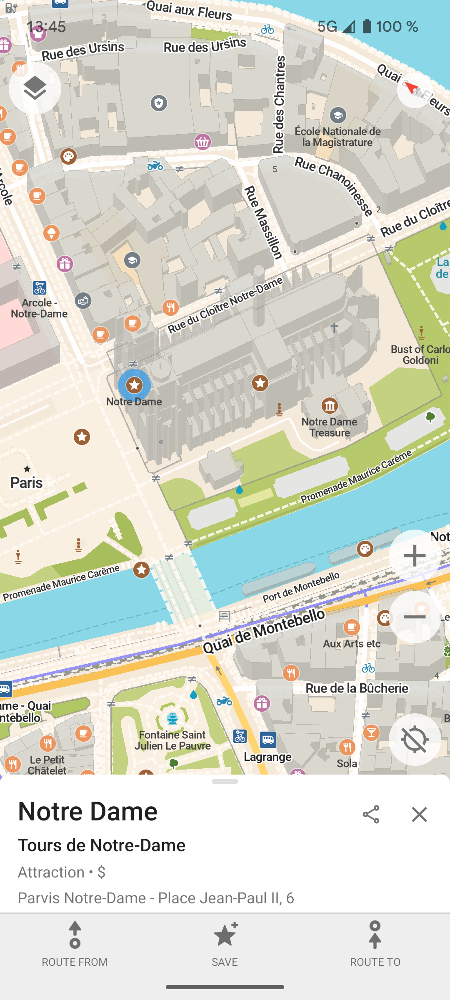
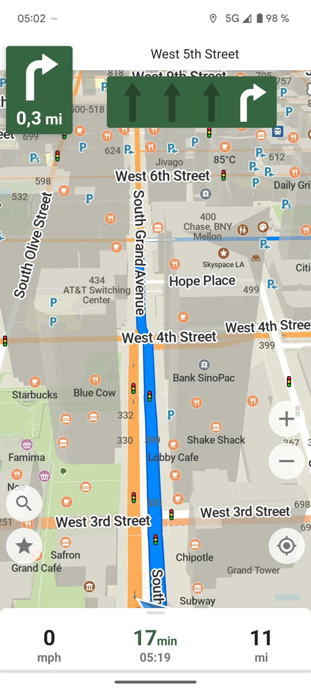
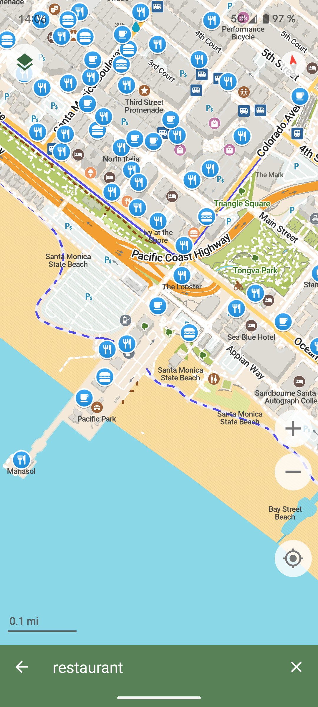
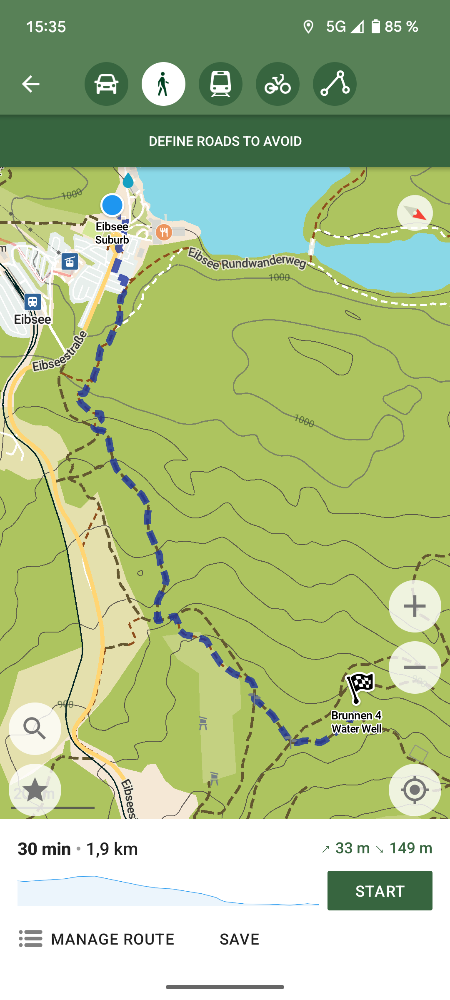

<!-- Navigation Bar -->
<p align="center">
  <a href="https://codeberg.org/comaps#comaps">Project Intro</a> |
  <a href="https://codeberg.org/comaps/Governance#comaps-project-governance-docs">Governance</a> |
  <a href="https://codeberg.org/comaps/Governance/src/branch/main/FAQ.md">FAQ</a> |
  <a href="#contributing">Contribute</a> |
  <a href="https://www.comaps.app/donate">Donate</a> |
  <a href="https://codeberg.org/comaps#keep-connected">Keep Connected</a>
</p>

<div align="center" >

</div>


<div align="center">
<h1><a href="https://comaps.app/">CoMaps</a></h1>
<h2>Hike, Bike, Drive Offline - Easy Map Navigation with Privacy</h2>
</div>
<div align="center">
  <p align="center">
    <a href="https://codeberg.org/comaps/comaps/releases">
      
    </a>
    <a href="https://github.com/comaps/comaps/actions/workflows/android-check.yaml">
      
    </a>
    <a href="https://github.com/comaps/comaps/actions/workflows/ios-check.yaml">
      
    </a>
    <a href="https://opencollective.com/comaps">
      
    </a>
    <a href="https://liberapay.com/CoMaps">
      
    </a>
  </p>
</div>

---

A community-led free & open source maps app based on [OpenStreetMap](https://www.openstreetmap.org), built for transparency, privacy, and not-for-profit values. A fork of Organic Maps, originally based on Maps.ME.

**Available for:** Android, iOS, ARM macOS, and alpha Linux/macOS desktop builds (also usable on Linux phones).

<p align="center">
  <a href="https://apps.apple.com/app/comaps/id6747180809">
    
  </a>
  <a href="https://play.google.com/store/apps/details?id=app.comaps.google">
    
  </a>
  <a href="https://f-droid.org/en/packages/app.comaps.fdroid/">
    
  </a>
  <a href="https://apps.obtainium.imranr.dev/redirect?r=obtainium://add/https://codeberg.org/comaps/comaps">
    
  </a>
  <a href="https://codeberg.org/comaps/comaps/releases">
    
  </a>
</p>


<!-- Screenshots -->
<p align="center">
  
  
  
  
  
  
</p>

---

## ⚡️ Highlights

- **Offline-first**: Navigate without a connection
- **Privacy-respecting**: No tracking, Ads or data collection
- **Lightweight**: Battery- and space-efficient
- **Simple**: Polished, user-focused interface
- **Community-built**: Free, open source, and collaborative
- **Transparent**: Open finances and governance

---

## 🚀 Main Features

- Downloadable detailed maps with places which are not available with Google Maps

- Outdoor mode with highlighted hiking trails, campsites, water sources, peaks, contour lines, etc

- Walking paths and cycleways

- Points of interest like restaurants, gas stations, hotels, shops, sightseeings and many more

- Search by name or an address or by point of interest category

- Navigation with voice announcements for walking, cycling, or driving

- Bookmark your favorite places with a single tap

- Offline Wikipedia articles

- Subway transit layer and directions

- Track recording

- Export and import bookmarks and tracks in KML, KMZ, GPX formats

- A dark mode to use during the night

- Improve map data for everyone using a basic built-in editor

- Android Auto and CarPlay support

 ***Freedom Is Here – Navigate the world with privacy and community at the forefront.***

---

## 🤝 Contributing

You can help by donating, contributing code, translating, or by telling others about it. To build the best maps app there is a need for software development, design, product, community development, and other areas. Reach out to us and let us know how you want to help.

- Build instructions: [docs/INSTALL.md](docs/INSTALL.md)  
- Contribution guide: [docs/CONTRIBUTING.md](docs/CONTRIBUTING.md)

There is a dedicated [Zulip](https://codeberg.org/comaps/Governance/src/branch/main/contribute.md#3-team-messaging) chat for active contributors.

---

## 💬 Feedback

- Rate us on [App Store](https://apps.apple.com/app/comaps/id6747180809) and [Google Play](https://play.google.com/store/apps/details?id=app.comaps.google)
- Star our repos on Codeberg 
- Report bugs or request features on the [issue tracker](https://codeberg.org/comaps/comaps/issues)

---

## 💸 Funding

CoMaps is free. To stay that way, it relies on your support.  
Donate via [OpenCollective](https://opencollective.com/comaps/donate) or [Liberapay](https://liberapay.com/CoMaps).  
The project's financial information is completely open and transparent at [our Open Collective](https://opencollective.com/comaps).

---

## 🔒 Privacy

The Android app has been reviewed by [Exodus Privacy](https://reports.exodus-privacy.eu.org/en/reports/app.comaps.google/latest/).

To [verify](https://developer.android.com/studio/command-line/apksigner#usage-verify) the APK, use the following signing certificate fingerprints:
```
SHA-256: 4894e8e6963627ef660031d8593fe77297f835acb4e23810003e926135023b4c
SHA-1: 8b7b5739f917e9f7c681671ced0c9c8562123ade
MD5: 9cce0ffea281dc2f0e0a154d6d2e281e
```
---

## ⚖️ License

Licensed under the Apache License 2.0.  
See [LICENSE](LICENSE), [NOTICE](NOTICE), and [data/copyright.html](data/copyright.html). 
